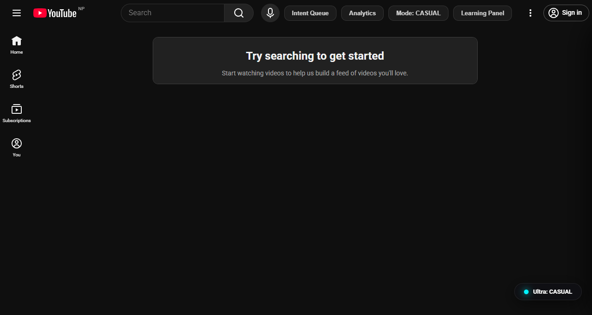
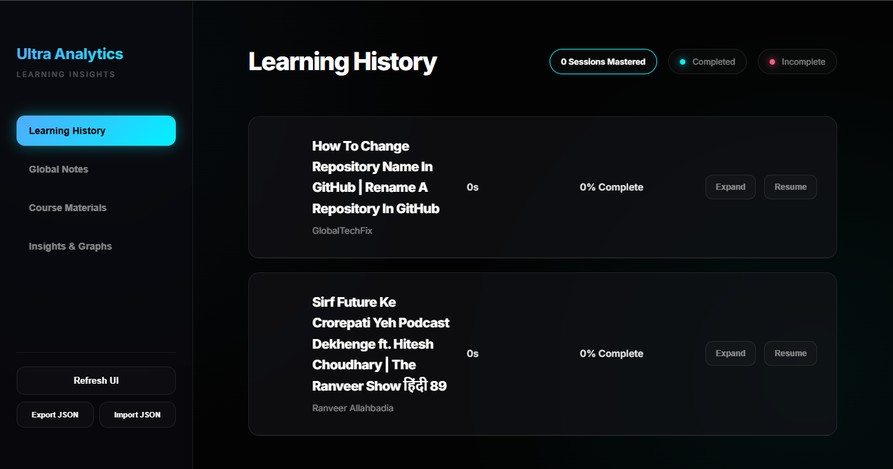

# 🎯 YouTube Ultra Productivity (V3)

**The distraction-free learning ecosystem for intentional YouTube usage.**

YouTube Ultra Productivity is a high-performance browser extension designed for students, researchers, and deep learners. It transforms YouTube from a distraction machine into a professional study environment.

---

*Figure 1: The new navigation bar featuring the Intent Queue, Mode Selector, and the Learning Suite panel.*

---

## 🚀 Key Features

### 1. Intent-Driven Navigation
Neutralize the algorithm before it catches you. This extension replaces the addictive homepage with a minimalist **Intent Queue**.

- **Monk Mode**: Total isolation. Hidden home feed, related videos, comments, and sidebars.
- **Study Mode**: Purposeful discovery. Allows search but keeps the player focused and clutter-free.
- **Intent Queue**: Your dashboard for unfinished business. resume previous learning sessions directly from the homepage.

### 2. The Integrated Learning Suite
A persistent side panel that turns every video into a workbench.

- **Timestamped Notes**: Quick-capture insights tied to the specific second of the video.
- **Visual Sketchpad**: Draw diagrams, mind maps, or equations directly on the player.
- **Session Progress**: Real-time tracking of your mastery percentage.
- **Focus Indicator**: No more guessing if you're in high-focus mode.

### 3. Aggressive Focus Protection
We don't just hide distractions; we hunt them down.

- **Shortcut Lockdown**: Aggressively blocks all distracting YouTube keyboard shortcuts (like the mini-player 'i' shortcut) to keep you in the frame.
- **The Shroud**: Positions the player centrally and dims the peripheral UI to eliminate side-eye distractions.
- **Exit Reflections**: If you pause or leave a session early, the extension asks for your "Intention," forcing a moment of mindfulness before you drift away.

### 4. Advanced Analytics Dashboard
A standalone command center for your learning history.

- **History Management**: Track completed vs. in-progress sessions with Red/Green status indicators.
- **Local Data Graphs**: Privacy-respecting SVG visualizations of your most-watched channels and note-taking density.
- **"Finish What You Started"**: Incomplete videos cannot be removed from history, enforcing learning discipline.

*Figure 2: The full Analytics Dashboard showing learning history, completion status, and visual insights.*

### 5. Privacy-First & Local-First
Your data is yours. No clouds, no servers, no tracking.

- **JSON Storage**: Human-readable data stored locally in your browser.
- **Export/Import**: One-click JSON backup to export your entire learning history to your physical drive.

---

## 🛠 Installation

1. Clone or download this repository from GitHub.
2. Open Chrome and go to `chrome://extensions`.
3. Enable **Developer Mode** (toggle in the top right).
4. Click **Load unpacked** and select the project folder.
5. Pin the extension for quick access to the Mode Toggle.

---

## 📖 How to Use

1. **Pick your Mode**: Use the Navbar buttons inside YouTube (Monk, Study, Casual) to set your environment.
2. **Commit to Learning**: When on a watch page, the side panel will automatically track your progress.
3. **Capture Everything**: Use the Notes and Sketchpad tabs to document your session.
4. **Analyze**: Visit the **Analytics Dashboard** via the popup to review your long-term growth.

---

## 🔒 Data Privacy
This extension uses `chrome.storage.local`. All your notes, sketches, and watch history are stored **only on your device**. If you uninstall the extension without exporting, your data will be permanently deleted unless backed up.

---

## 🏗 Technology Stack
- **Manifest V3**: Using modern extension security standards.
- **Vanilla JS & CSS**: No heavy frameworks for maximum performance.
- **Native SVG**: For high-performance, private analytic visualizations.
- **JSON Manifests**: Robust, portable local data management.

---

---

**Built for intentional learners. Made for the deep work era.**
